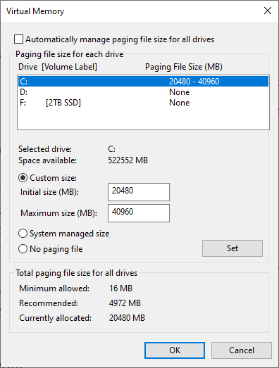
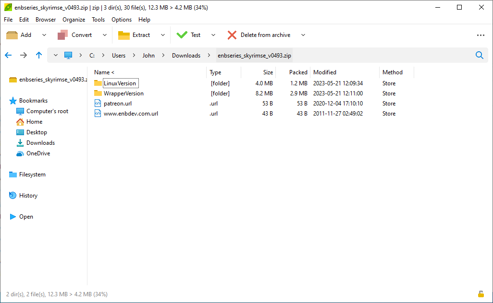
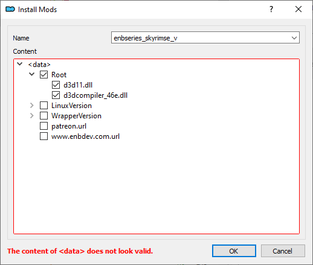
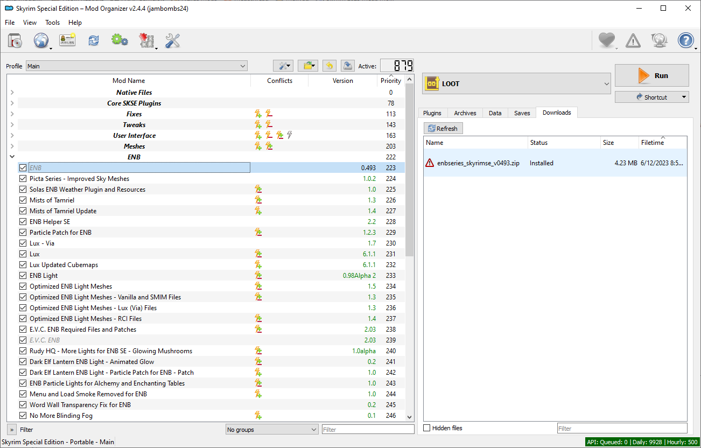
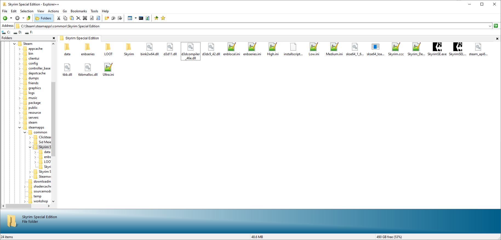

# Enhanced and Modernized
Github page for the Skyrim load order Enhanced and Modernized.

The list itself is here: [Skyrim 2023 Mega Mod List](https://www.nexusmods.com/skyrimspecialedition/mods/82863).

## Requirements

- Skyrim Special Edition from either Steam (1.6.640) or GOG (1.6.659).
- The Anniversary Edition upgrade.
- A 64-bit operating system.

## Installation Guide

### Step One: Prepare Your Computer
To help make the game run as well as possible, you need to increase the size of the page file.

- Start typing "Advanced system settings" into your Windows search bar, and select "View Advanced System Settings" when it appears.
- Switch to the Advanced tab.
- Press the Settings button in the performance section.
- Switch to the Advanced tab (again).
- Press the Change button in the "Virtual memory" section.
- Uncheck the box that auto-manages page file size.
- Select whatever drive you plan to install Skyrim on.
- Select the "Custom size" option.
- Set the minimum to at least 20480 (20GB), and the maximum to something higher (recommended: 40960 (40GB)).
  - You need to have enough free space on your drive to fit the whole page file, even after intsalling this list.
- Press "Set" to commit your changes.
- Keep pressing OK until you get out of all the settings windows.
- Restart your computer.

*I don't care how much RAM you have; you need to do this.*

### Step Two: Prepare Skyrim
Uninstall Skyrim completely from your system. Then delete the whole Skyrim SE directory, which is typically something like *~\Steam\steamapps\common\Skyrim Special Edition*. Also delete the Skyrim folder at *~\Documents\My Games*.

We're going to reinstall it! Install the game. If you're on GOG, make sure to download all the DLC content too.

Now launch Skyrim. Let the launcher set a graphics preset, and then load to Skyrim's main menu. If you haven't downloaded the CC content yet, go ahead and do so. Exit the game afterwards.

After doing all this, you should have a **completely vanilla Skyrim AE installation**.
Let's move on.

### Step Three: Accounts
Create an account for the following websites if you don't already have one:
- [Nexus Mods](https://www.nexusmods.com/)
- [LoversLab](https://www.loverslab.com/)

*Note: LoversLab is banned in some countries. You may need a VPN if LL has indeed been blocked.*

### Step Four: Acquire Wabbajack
Go to [Wabbajack.org](https://www.wabbajack.org/) and download the program.

Place the downloaded executable somewhere outside of any protected files. I have it placed in *C:\Modding\Wabbajack*. When you run this executable, is will automatically download the latest version of the entire Wabbajack program.

Once you've launched Wabbajack, click the settings button in the top right. Connect to your Nexus account.

### Step Five: LoversLab Mods
LoversLab has a buggy API, so it's easiest to download all the needed mods from there preemptively.
Go and download each of these:
(Parenthesis after the mod link will tell you which file to download, if necessary.)

- [Schlongs of Skyrim AE - No DLL Version](https://www.loverslab.com/files/file/23433-schlongs-of-skyrim-ae-no-dll-version/)
- [Schlongs of Skyrim Uncloaked](https://www.loverslab.com/files/file/19122-schlongs-of-skyrim-uncloaked/) (Main mod only.)
- [Valerica - Serana's Mom Has Got it Goin On](https://www.loverslab.com/files/file/27333-valerica-seranas-mom-has-got-it-goin-on-sexlab-and-flower-girl-editions/) (Latest SLab edition.)
- [Frea the Gullible](https://www.loverslab.com/files/file/27716-frea-the-gullible-sexlab-and-flower-girl-editions/) (Latest SLab edition.)
- [Borgakh the Purchased Wife](https://www.loverslab.com/files/file/27424-borgakh-the-purchased-wife-slab-and-flower-girl-editions/) (Latest SLab edition.)
- [Lydia the Loyal](https://www.loverslab.com/files/file/27805-lydia-the-loyal/) (Latest SLab edition.)
- [Jordis the Naive or Naughty](https://www.loverslab.com/files/file/27555-jordis-the-naive-or-naughty-sexlab-and-flower-girl-editions/) (Latest SLab edition.)

You don't need to extract any of these. Wabbajack will do that later.

### Step Six: Wabbajack Prep
Download the Enhanced and Modernized archive and extract it. Keep the two files in the same location.

Now open the Wabbajack program, and choose the install from disk button on the home page.
Select the .wabbajack file you just downloaded for "Target Modlist".

For "Modlist Installation Location", choose where you want the modlist to go. It needs to be outside of Windows' User Account Control system.
I recommend somewhere like "C:\Games\Skyrim_EM".
This should also be an empty directory.

"Resource Download Location" can be pretty much anywhere. By default, it'll be inside the modlist installation directory.
You can even place the downloads folder on a separate drive. Just be aware that you're liimited to the speed of your slowest drive.
After you've chosen a downloads location, place all the LoversLab archives there.

### Step Seven: Downloading
When you're sure with all your file path decisions, press the button to start the Wabbajack installation process.

First of all, every mod has to be downloaded.
This will take some time. If you have a Nexus Mods premium account, all Nexus files will download automatically.
Otherwise, the download button must be pressed for each mod.

If Wabbajack freezes, crashes, or otherwise has to shutdown, it will pick up downloading where it left off. I've never had it crash during the actual installation process.
Speaking of...

### Step Eight: Installation
Wabbajack will proceed to install Mod Organizer 2 and all the mods into the directory you specified earlier.
This will also take a fair amount of time, although not nearly as much as the downloading step.

Run the newly acquired Mod Organizer 2 executable to access the modlist.

Note: If you have the GOG version of the game, replace the one .dll in MO2's plugins folder with the update file found on the [Mod Organizer Nexus page](https://www.nexusmods.com/skyrimspecialedition/mods/6194).

### Step Nine: ENB
There's a few more additions to make before the modlist is fully installed.
Start by heading to the [ENB Website](http://enbdev.com/download.html) and clicking on "TES Skyrim SE" in the graphics modification section.
Download the latest version of ENB available.

Delete "enbseries_sdk.zip" from inside the ENB archive.
You can do this by using a tool that can manipulate archives like [PeaZip](https://peazip.github.io/), or by extracting the archive, deleting the file, and recompressing it.
Either way, get rid of the SDK.

After that, drag the recompressed archive into MO2's downloads panel. Install it manually.
In the filetree that appears, right-click on "data" and create a directory named "Root" (no quotes).
Move the two .ddl files, named d3d11.dll and d3dcompiler_46e.dll respectively, from inside of WrapperVersion to Root.
Then uncheck the boxes for everything other than Root:

Then name the mod something reasonable, press OK to install it, and "Ignore" on the next popup.
Once you have ENB installed, move it to the top of the ENB section.
Remember to enable it as well.

You can check that you've done this part correctly by running MO2's explorer virtual folder program.
Move up one directory to the game's root folder, and check that the two DLL files mentioned earlier are present.

### Step Ten: Customization
There are a few things you can do to customize the modlist.

First of all, if you're on GOG, set the active profile to "GOG". This switches all version-specific SKSE plugins to their 1.6.659 variants.

If you prefer that your player character does not speak and remains silent, expand the "Bottom Dwellers" section and disable all of these:
- Dragonborn Voice Over
- Dragonborn Voice Over Dialogue Interface ReShaped Patch
- Dragonborn Voice Over - Plugin Replacer
- DBVO Plugin Replacer - Reverb Interior Sound Expansion Patch
- Bella Voice DBVO
